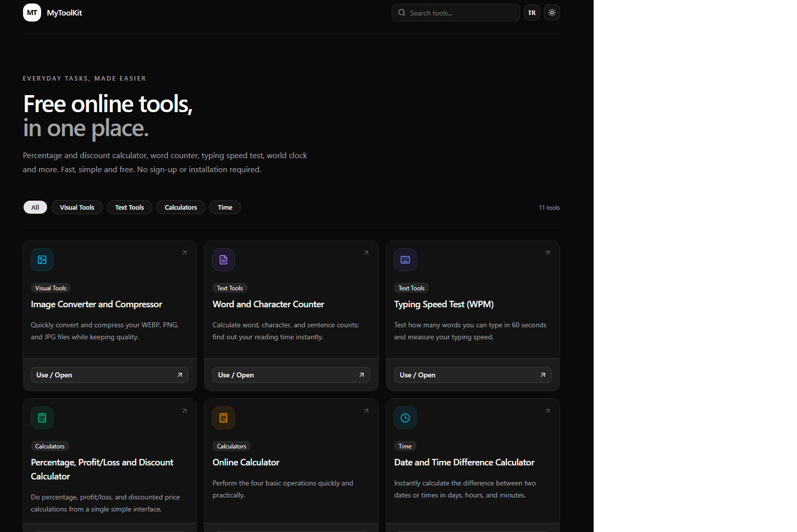

# MyToolKit

**Live site:** [mytoolkitbase.com](https://www.mytoolkitbase.com)

A free, bilingual (Turkish/English) collection of everyday online tools — no sign-up, no installation, everything runs in your browser.



## What it does

MyToolKit brings together 11 free web tools in one place:

- **Calculators:** Percentage & Profit/Loss, Classic Calculator, BMI, GPA, Age Calculator
- **Time:** Date & Time Difference, Stopwatch & Timer, World Clock
- **Text:** Word & Character Counter, Typing Speed Test (WPM)
- **Visual:** Image Converter & Compressor

All calculations happen client-side in the browser — no data is uploaded to a server, and no account is required for any tool.

## Features

- 🌍 Full Turkish and English support (`/tr` and `/en` routes)
- 🌓 Light / dark theme
- 💾 Client-side persistence (your inputs are remembered locally, never sent to a server)
- 📱 Responsive, works on mobile and desktop
- ⚡ Fast, static-friendly pages with per-tool SEO metadata (Open Graph, hreflang, JSON-LD)

## Tech stack

- [Next.js](https://nextjs.org/) (App Router)
- [React](https://react.dev/)
- [TypeScript](https://www.typescriptlang.org/)
- [Tailwind CSS](https://tailwindcss.com/)
- [shadcn/ui](https://ui.shadcn.com/) components
- [lucide-react](https://lucide.dev/) icons

## Running locally

```bash
git clone https://github.com/<your-username>/<your-repo>.git
cd <your-repo>
npm install
npm run dev
```

Then open [http://localhost:3000/tr](http://localhost:3000/tr) or [http://localhost:3000/en](http://localhost:3000/en).

## License

This project is open for reference and learning purposes. See [LICENSE](./LICENSE) for details.
